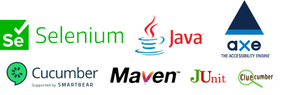

# Teste automatizado de acessibilidade Selenium Java, Cucumber, AXE.

Este é um modelo criado como exemplo para realizar a automação de testes de acessibilidade utilizando os frameworks Selenium+Cucumber+Java com o Axe.
O exemplo foi executado em uma URL criada para treinar automação de teste WEB.

___

O **Selenium** é um conjunto de ferramentas para automatizar navegadores da Web.
O Selenium WebDriver conduz um navegador nativamente, como um usuário real faria, localmente ou em máquinas remotas.

**Axe** é um mecanismo de teste de acessibilidade para sites e outras interfaces de usuário baseadas em HTML. É rápido, seguro, leve, e foi construído para se integrar perfeitamente a qualquer ambiente de teste existente para que você possa automatizar testes de acessibilidade ao lado de seus testes funcionais regulares.

O **"axe-core Selenium (Java)"** é uma ferramenta para usar o Axe para testes utilizando Junit e Selenium.
A integração do Selênio permite o teste de páginas e sites completos.
Para maiores detalhes, acesse o link: https://github.com/dequelabs/axe-core-maven-html

#
# Getting Started

Antes de começar, verifique se você tem instalado em sua maquina o **Maven** o navegador **Google Chrome** e o **Java**(V >=11).
```console
mvn -version
java -version
```

___
**Instalação e 1º execução**
Instale as dependências e rode o primeiro teste executando o comando abaixo na raiz do projeto:
```console
mvn  install
```
Após a execução dos testes, um relatório em HTML é gerado na pasta `target\generated-report`. Dentro desta pasta abra o arquivo `index.html` para visualizar o relatório no seu browser e acessar todos os detalhes da execução. 


O relatório utilizado foi o [Cluecumber Report Plugin](https://github.com/trivago/cluecumber-report-plugin), para mais configurações acesse a documentação no [link](https://github.com/trivago/cluecumber-report-plugin).

___

**Execução dos Testes**

Após a instalação das dependências e a execução do primeiro teste, você pode executar somente os testes utilizando o comando abaixo na raiz do projeto:

```console
mvn test
```

Após essa execução, o relatório de teste não será atualizado automaticamente. Para atualizar o relatório execute o comando abaixo:

```console
mvn cluecumber-report:reporting
```
___


# Análise de impacto e conformidade
No relatório é possível verificar os alertas de acessibilidade.
Segue abaixo um exemplo de como o alerta é exibido:

```txt
 {
    "id": "meta-viewport",
    "description": "Ensures \u003cmeta name\u003d\"viewport\"\u003e does not disable text scaling and zooming",
    "help": "Zooming and scaling must not be disabled",
    "helpUrl": "https://dequeuniversity.com/rules/axe/4.1/meta-viewport?application\u003daxeAPI",
    "impact": "critical",
    "tags": [
      "cat.sensory-and-visual-cues",
      "best-practice",
      "ACT"
    ],
    "nodes": [
      {
        "impact": "critical",
        "any": [
          {
            "id": "meta-viewport",
            "impact": "critical",
            "message": "user-scalable\u003dno on \u003cmeta\u003e tag disables zooming on mobile devices",
            "data": "user-scalable\u003dno",
            "relatedNodes": []
          }
        ],
        "all": [],
        "none": [],
        "failureSummary": "Fix any of the following:\n  user-scalable\u003dno on \u003cmeta\u003e tag disables zooming on mobile devices",
        "html": "\u003cmeta name\u003d\"viewport\" content\u003d\"width\u003ddevice-width, initial-scale\u003d1.0, maximum-scale\u003d1.0, user-scalable\u003dno\"\u003e",
        "target": [
          "meta[name\u003d\"viewport\"]"
        ]
      }
    ]
  },
```
Neste exemplo temos um impacto crítico sendo validado as boas práticas.

Ao abrir o link indicado no [**"helpUrl"**](https://dequeuniversity.com/rules/axe/4.1/meta-viewport?application\u003daxeAPI), nele é exibido toda a descrição do impacto, a importância e a forma de correção.
Também é exibido um resumo com as principais informações.


----
Segue abaixo o link que contém a lista de todas as regras de acessibilidade que podem ser aplicadas nos testes:
- https://github.com/dequelabs/axe-core/blob/master/doc/rule-descriptions.md


# Referências


- **AXe Selenium Integration** https://mvnrepository.com/artifact/com.deque.html.axe-core/selenium/4.1.1
- **Deque Systems** - https://www.deque.com/blog/axe-core-packages-migrating/
- **dequelabs/axe-core-maven-html** - https://github.com/dequelabs/axe-selenium-java
- **Selenium** - https://www.selenium.dev/
- **Cucumber** - https://cucumber.io/
- **Cluecumber Report Plugin** -https://github.com/trivago/cluecumber-report-plugin
