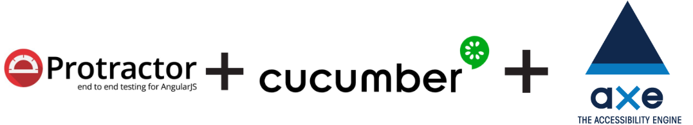

# Teste automatizado de acessibilidade

Este é um modelo criado como exemplo para realizar a automação de testes de acessibilidade utilizando os frameworks Protractor+Cucumber com o Axe.
O exemplo foi executado em uma URL criada para treinar automação de teste WEB.

___

O **Protractor** é um framework de teste E2E para aplicações Angular e AngularJS. O Protractor executa testes no seu aplicativo em execução em um navegador real, interagindo com ele como um usuário faria.

**Axe** é um mecanismo de teste de acessibilidade para sites e outras interfaces de usuário baseadas em HTML. É rápido, seguro, leve, e foi construído para se integrar perfeitamente a qualquer ambiente de teste existente para que você possa automatizar testes de acessibilidade ao lado de seus testes funcionais regulares.

O **"@axe-core/webdriverjs"** fornece uma API Axe  para o WebDriverJS do Selenium e injeta automaticamente em todos os Frames.
Para saber mais sobre o "@axe-core/webdriverjs" acesse:

- https://www.npmjs.com/package/@axe-core/webdriverjs

#
# Getting Started

Antes de começar, verifique se você tem o Node instalado em sua maquina.
```console
node --version
npm --version
```
Se não tiver, procure como instalar em - https://nodejs.org
___

Instale as dependências executando o comando na raiz do projeto: 
```console
npm install
```
Em seguida, atualize os drivers dos navegadores:

```console
npm run wm-update
```

Agora execute os testes:

```console
npm run test
```
Após a execução dos testes, um relatório em HTML é gerado e aberto automaticamente com as informações da execução. 
O relatório utilizado foi o [multiple-cucumber-html-reporter](https://www.npmjs.com/package/multiple-cucumber-html-reporter)

# Análise de impacto e conformidade
No relatório é possivel verificar os alertas de acessibilidade.
Segue abaixo um exemplo de como o alerta é exibido:

```txt
{
    "description": "Ensures (meta name=\"viewport\") does not disable text scaling and zooming",
    "help": "Zooming and scaling must not be disabled",
    "helpUrl": "https://dequeuniversity.com/rules/axe/4.0/meta-viewport?application=webdriverjs",
    "id": "meta-viewport",
    "impact": "critical",
    "nodes": [
      {
        "all": [],
        "any": [
          {
            "data": "user-scalable=no",
            "id": "meta-viewport",
            "impact": "critical",
            "message": "user-scalable=no on (meta) tag disables zooming on mobile devices",
            "relatedNodes": []
          }
        ],
        "failureSummary": "Fix any of the following:\n  user-scalable=no on (meta) tag disables zooming on mobile devices",
        "html": "(meta name=\"viewport\" content=\"width=device-width, initial-scale=1.0, maximum-scale=1.0, user-scalable=no\")",
        "impact": "critical",
        "none": [],
        "target": [
          "meta[name=\"viewport\"]"
        ]
      }
    ],
    "tags": [
      "cat.sensory-and-visual-cues",
      "best-practice"
    ]
  },
```
Neste exemplo temos um impacto crítico sendo validado as boas práticas.

Ao abrir o link indicado no **"helpUrl"**, nele é exibido toda a descrição do impacto e até mesmo a forma de correção.
Também é exibido um resumo com as principais informações.


----
Segue abaixo o link que contém a lista de todas as regras de acessibilidade que podem ser aplicadas nos testes
- https://github.com/dequelabs/axe-core/blob/master/doc/rule-descriptions.md


# Referencias
- http://www.protractortest.org/#/
- https://www.npmjs.com/package/axe-core
- https://medium.com/capital-one-tech/accessibility-regression-with-protractor-in-less-than-30-minutes-9abf1fd4f558
- https://www.deque.com/?s=webdriver
- https://github.com/dequelabs/axe-core/tree/master
- https://www.npmjs.com/package/multiple-cucumber-html-reporter

