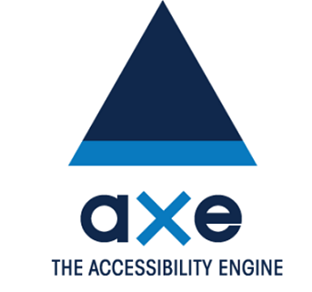

# Teste automatizado de acessibilidade com Axe

Neste repositório contem modelos criados como exemplo para realizar a automação de testes de acessibilidade utilizando o framework Axe.

___

**Axe** é um mecanismo de teste de acessibilidade para sites e outras interfaces de usuário baseadas em HTML. É rápido, seguro, leve, e foi construído para se integrar perfeitamente a qualquer ambiente de teste existente para que você possa automatizar testes de acessibilidade ao lado de seus testes funcionais regulares.

#
## Exemplos neste repositório

Abaixo segue os links dos exemplos que você irá encontrar neste repositório.
Neles você também irá encontrar detalhes sobre como executá-los.

- **JavaScript**
   * [Protractor + Cucumber com AXE](Protractor_AxeWebdriver).
- **Java** 
   * [Selenium + Cucumber + Java com AXE](Cucumber_Java_Axe).

# Referências
- https://www.deque.com